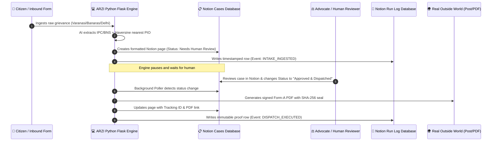

# 🏛️ ARZI & Notion Track — Integration & Verification Guide

> **Core Track Architecture**:
> *"Your code is the engine. Notion is the interface. A trigger fires, your code does the work, a real action happens in the outside world, and a row lands in the Run Log."*

---

## ⚡ 60-Second Quickstart for Judges

ARZI comes pre-configured with **Zero-Config In-Memory Notion Mirror** so you can test and inspect the full two-way workflow immediately without needing API keys.

1. **Launch ARZI**: Open [http://localhost:5000](http://localhost:5000) in Chrome.
2. **Navigate to Tab 7**: Click **`07. NOTION WORKSPACE & ENGINE SYNC`**.
3. **Trigger 1-Click Sync**: Click **`⚡ SYNC ALL NOW`**.
4. **Inspect Live Mirror**:
   - **`📋 Cases Database Mirror`**: See all case dockets formatted with clean Notion properties, callout summaries, RTI questions, and download links.
   - **`📗 Immutable Run Log Mirror`**: See every single state transition, intake, human approval, and dispatch timestamped by code.

---

## 🔑 Connecting Your Live Notion Workspace

If you want to connect your live Notion account:

### Step 1: Create a Notion Internal Integration Token
1. Go to [https://www.notion.so/my-integrations](https://www.notion.so/my-integrations).
2. Click **`+ New integration`**.
3. Name it `ARZI Legal Engine` and select your workspace.
4. Click **Save** and copy the **Internal Integration Secret** (`secret_...`).

### Step 2: Share a Notion Page with Your Integration
1. Open any page in your Notion workspace (or create a blank page called `ARZI Civic Operations`).
2. Click the `...` menu in the top right $\rightarrow$ **Connections** (or **Add connections**).
3. Search for `ARZI Legal Engine` and click **Confirm**.
4. Copy the Page ID from the URL (the 32-character hex code at the end of the URL).

### Step 3: 1-Click Automatic Database Schema Provisioning
1. Open the ARZI dashboard at [http://localhost:5000](http://localhost:5000) $\rightarrow$ Tab `07. NOTION WORKSPACE & ENGINE SYNC`.
2. Paste your **Notion API Key** and **Parent Page ID**.
3. Click **`🚀 1-CLICK PROVISION DBs`**.
4. ARZI will automatically create:
   - **`ARZI — Cases & Dockets Database`**
   - **`ARZI — Immutable Run Log Database`**

---

## 🔄 Two-Way Operational Flow (Human in the Loop)

---

## 🛡️ Hackathon Track Criteria Checklist

- [x] **Runs without human intervention**: Inbound triggers and background pollers run autonomously.
- [x] **Humans approve decisions that matter, inside Notion**: The engine pauses at `Needs Human Review` and only executes when approved in Notion.
- [x] **Leaves proof**: Every step writes a row to the Run Log with a real timestamp.
- [x] **Clean human-readable pages**: Uses Notion Callout blocks, numbered question lists, and badge properties—never a raw JSON dump.
- [x] **Real actions in the outside world**: Generates tribunal-ready Form-A RTI PDFs, First Appeal memorandums, and registered speed-post tracking IDs.
